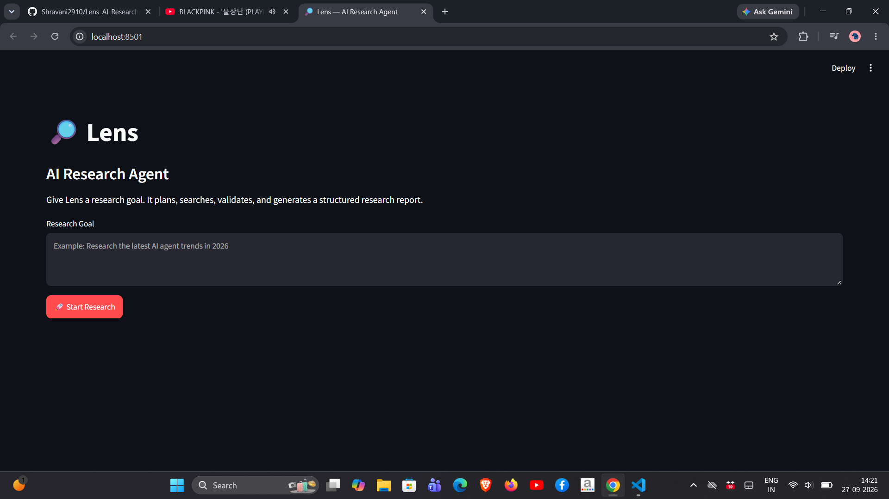

# 🔎 Lens — AI Research Agent

> **Give it a research goal. Lens plans, searches, validates, and reports.**

Lens is an AI-powered research agent that autonomously performs multi-step web research from a natural-language goal.

Instead of simply generating an answer, Lens follows an agentic workflow:

**Goal → Planning → Research → Validation → Iteration → Synthesis → Report**

---

## 1. Problem Statement

Researching a topic manually requires users to:

* Break a broad question into smaller research tasks.
* Find relevant information from multiple sources.
* Check whether enough information has been collected.
* Perform additional research when gaps remain.
* Synthesize the collected information into a useful report.

Lens automates this workflow using an LLM, web-search tools, state management, and conditional workflow execution.

The user provides a research goal, and Lens determines how to research it before producing the final report.

---

## 2. How Lens Works

Lens uses a **Plan-and-Execute agentic architecture** implemented with LangGraph.

```text
┌──────────────────────┐
│     User Goal        │
│ "Research a topic"   │
└──────────┬───────────┘
           │
           ▼
┌──────────────────────┐
│   Planning Agent     │
│ Break goal into      │
│ logical research     │
│ steps                 │
└──────────┬───────────┘
           │
           ▼
┌──────────────────────┐
│   Research Agent     │
│ Generate queries     │
│ + execute web search │
└──────────┬───────────┘
           │
           ▼
┌──────────────────────┐
│  Validation Agent    │
│ Is the information   │
│ sufficient?          │
└───────┬────────┬─────┘
        │        │
   Missing      Complete
        │        │
        ▼        ▼
┌─────────────┐  ┌──────────────────────┐
│ More Search │  │  Synthesis Agent     │
│ / Iterate   │  │ Generate final       │
└──────┬──────┘  │ research report      │
       │         └──────────┬───────────┘
       │                    │
       └──────► Research ◄──┘
                            │
                            ▼
                   ┌─────────────────┐
                   │  Final Report   │
                   └─────────────────┘
```

---

## 3. Agentic Workflow

### 1. Planning

The Planning Agent receives the user's research goal and uses the LLM to break it into 3–5 logical research steps.

### 2. Research

For each research step, the Research Agent:

* Generates focused search queries using the LLM.
* Executes web searches.
* Collects titles, URLs, and snippets.
* Maintains the collected results in workflow state.

### 3. Validation

The Validation Agent evaluates whether the collected information is sufficient for the current research step.

If information is missing, the workflow sends the agent back to research.

### 4. Iteration

Lens can perform additional research when the validator identifies missing information.

A safety limit prevents uncontrolled workflow loops.

### 5. Synthesis

Once the planned research is complete, the Synthesis Agent combines the collected evidence into a structured report.

The report contains:

* Key findings
* Analysis
* Relevant sources

---

## 4. Key Agentic Concepts Demonstrated

Lens demonstrates several core agentic AI patterns:

| Concept               | Implementation                                         |
| --------------------- | ------------------------------------------------------ |
| Natural-language goal | User provides a research objective                     |
| Planning              | LLM generates research steps                           |
| Tool use              | Web-search tool retrieves external information         |
| Reasoning             | LLM decides queries and evaluates research sufficiency |
| State                 | LangGraph maintains research state                     |
| Conditional routing   | Validator determines whether to research again         |
| Iteration             | Missing information triggers additional research       |
| Synthesis             | LLM produces the final report                          |
| Safety control        | Iteration limit prevents infinite loops                |

---

## 5. Technology Stack

* **Python** — Core implementation
* **LangGraph** — Agent workflow orchestration
* **LangChain** — LLM integration
* **Groq** — LLM inference
* **OpenAI GPT-OSS 120B** — LLM model used through Groq
* **DDGS** — Web search
* **Streamlit** — User interface
* **Pydantic** — Data validation
* **BeautifulSoup** — Web-content utilities
* **Requests** — HTTP utilities

---

## 6. Project Structure

```text
lens-ai-research-agent/
│
├── app/
│   ├── agents/
│   │   ├── planner.py
│   │   ├── researcher.py
│   │   ├── validator.py
│   │   └── synthesizer.py
│   │
│   ├── tools/
│   │   └── web_search.py
│   │
│   ├── __init__.py
│   ├── config.py
│   ├── graph.py
│   ├── main.py
│   └── state.py
│
├── tests/
├── screenshots/
├── .gitignore
├── .env
├── requirements.txt
└── README.md
```

---

## 7. Setup

### Clone the repository

```bash
git clone <YOUR_GITHUB_REPOSITORY_URL>
cd lens-ai-research-agent
```

### Create a virtual environment

```bash
python -m venv venv
```

### Activate it

Windows PowerShell:

```powershell
.\venv\Scripts\Activate.ps1
```

### Install dependencies

```bash
pip install -r requirements.txt
```

### Configure the API key

Create a `.env` file:

```text
GROQ_API_KEY=your_groq_api_key
GROQ_MODEL=openai/gpt-oss-120b
```

**Never commit the `.env` file to GitHub.**

---

## 8. Run Lens

Start the Streamlit application:

```bash
streamlit run app/main.py
```

Then open the local Streamlit URL shown in the terminal.

Enter a research goal and click:

**Start Research**

---
## 8.1 Demo Screenshots

### Research Input



### Generated Research Report


## 9. Example

### Input

```text
latest AI agent trends in 2026
```

### Example workflow

```text
User Goal
   ↓
Planning
   ↓
Research
   ↓
Validation
   ↓
More Research if required
   ↓
Synthesis
   ↓
Final Report
```

### Example output

```text
# Research Summary

## Key Findings

- AI agents are expanding into software development and workplace workflows.
- Agent governance frameworks are receiving increased attention.
- Standardized agent interfaces are being developed.
- Multi-agent architectures are being explored for scalability.
- Research is focusing on improving agent reliability and reasoning.

## Analysis

The collected research indicates increasing development of
agentic systems across practical workflows, alongside work on
governance, interoperability, scalability, and reliability.

## Sources

Relevant research sources are included in the generated report.
```

---

## 10. State Management

Lens maintains workflow state using a typed `ResearchState`.

The state includes:

```text
user_goal
research_plan
current_step
search_queries
search_results
findings
missing_information
iteration_count
final_report
status
```

This allows information collected during one stage of the workflow to be used by later stages.

---

## 11. Safety and Reliability

Lens includes several controls to make the workflow more predictable:

* LLM temperature is set to `0`.
* Search results are limited.
* Duplicate URLs are removed during synthesis.
* The synthesis context is limited to prevent oversized LLM requests.
* A maximum iteration limit prevents infinite research loops.
* The system is instructed not to invent information during validation and synthesis.

---

## 12. Limitations

Lens is a hackathon prototype and has some limitations:

* Search quality depends on the available web-search service.
* Search snippets may not contain the complete content of a source.
* LLM-generated analysis can still contain errors.
* The current prototype does not persist research sessions in a database.
* Results are generated during the current session.
* The system does not guarantee that every source is authoritative.

Users should verify important information against the original sources.

---

## 13. Future Improvements

Potential future improvements include:

* Full webpage extraction and source verification.
* Citation-aware evidence tracking.
* Persistent research sessions.
* Better source ranking and deduplication.
* Parallel research execution.
* Human approval checkpoints.
* Research history and export functionality.
* Additional search and data tools.

---
## APP Deploy Link
Here is Live Streamlit Deployed Application :   https://lensairesearchagent-7rvaek4xgaxw77ilfkpjtv.streamlit.app/


## 15. Demo

A PPT showing the Lens workflow is included with the hackathon submission.

---

## 16. License

This project was created as an original hackathon prototype.
by Shravani Jagtap
